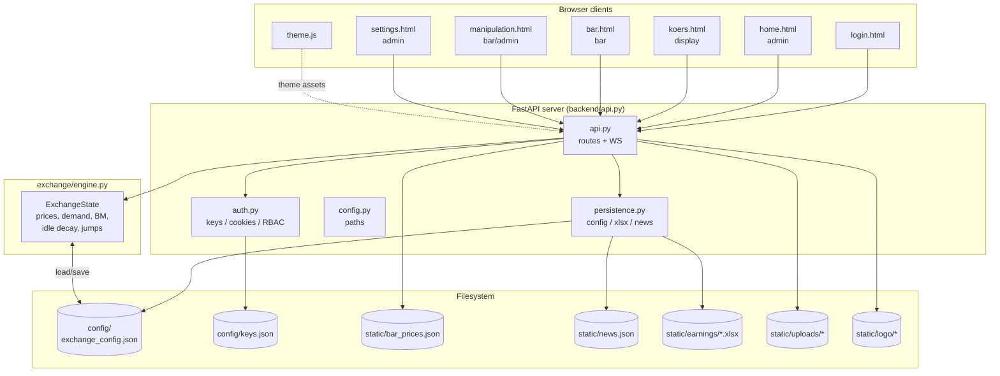
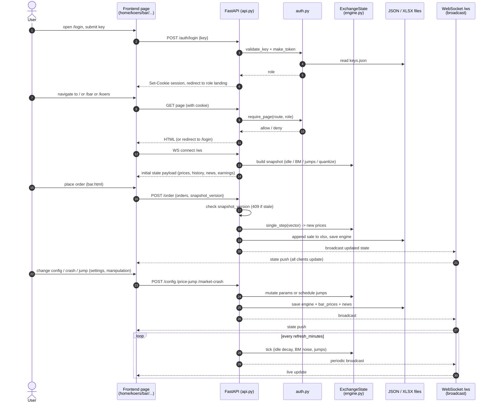

# BorrelBeurs — Architecture

## 1. Project structure / components

```mermaid
---
id: 6acd4600-f0b0-4018-898f-c71aebf04989
---
graph TB
    subgraph Client["Browser clients"]
        L[login.html]
        H[home.html<br/>admin]
        K[koers.html<br/>display]
        B[bar.html<br/>bar]
        M[manipulation.html<br/>bar/admin]
        S[settings.html<br/>admin]
        T[theme.js]
    end

    subgraph Server["FastAPI server (backend/api.py)"]
        API[api.py<br/>routes + WS]
        AUTH[auth.py<br/>keys / cookies / RBAC]
        CFG[config.py<br/>paths]
        PERS[persistence.py<br/>config / xlsx / news]
    end

    subgraph Engine["exchange/engine.py"]
        E[ExchangeState<br/>prices, demand, BM,<br/>idle decay, jumps]
    end

    subgraph Storage["Filesystem"]
        CJ[(config/<br/>exchange_config.json)]
        KJ[(config/keys.json)]
        BP[(static/bar_prices.json)]
        NJ[(static/news.json)]
        XL[(static/earnings/*.xlsx)]
        UP[(static/uploads/*)]
        LG[(static/logo/*)]
    end

    L --> API
    H --> API
    K --> API
    B --> API
    M --> API
    S --> API
    T -.theme assets.-> API

    API --> AUTH
    API --> PERS
    API --> E
    AUTH --> KJ
    PERS --> CJ
    PERS --> XL
    PERS --> NJ
    API --> BP
    API --> UP
    API --> LG
    E <-->|load/save| CJ
```

## 2. Information flow through the web app

```mermaid
sequenceDiagram
    autonumber
    actor U as User
    participant FE as Frontend page<br/>(home/koers/bar/...)
    participant API as FastAPI (api.py)
    participant AUTH as auth.py
    participant ENG as ExchangeState<br/>(engine.py)
    participant FS as JSON / XLSX files
    participant WS as WebSocket /ws<br/>(broadcast)

    U->>FE: open /login, submit key
    FE->>API: POST /auth/login {key}
    API->>AUTH: validate_key + make_token
    AUTH->>FS: read keys.json
    AUTH-->>API: role
    API-->>FE: Set-Cookie session, redirect to role landing

    U->>FE: navigate to / or /bar or /koers
    FE->>API: GET page (with cookie)
    API->>AUTH: require_page(route, role)
    AUTH-->>API: allow / deny
    API-->>FE: HTML (or redirect to /login)

    FE->>API: WS connect /ws
    API->>ENG: build snapshot (idle / BM / jumps / quantize)
    API-->>FE: initial state payload (prices, history, news, earnings)

    U->>FE: place order (bar.html)
    FE->>API: POST /order {orders, snapshot_version}
    API->>API: check snapshot_version (409 if stale)
    API->>ENG: single_step(vector) -> new prices
    API->>FS: append sale to xlsx, save engine
    API-->>WS: broadcast updated state
    WS-->>FE: state push (all clients update)

    U->>FE: change config / crash / jump (settings, manipulation)
    FE->>API: POST /config /price-jump /market-crash
    API->>ENG: mutate params or schedule jumps
    API->>FS: save engine + bar_prices + news
    API-->>WS: broadcast
    WS-->>FE: state push

    loop every refresh_minutes
        API->>ENG: tick (idle decay, BM noise, jumps)
        API-->>WS: periodic broadcast
        WS-->>FE: live update
    end
```
